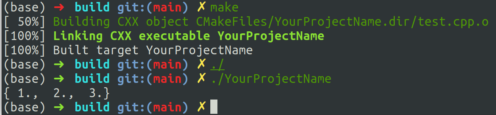

# 环境配置

- vision studio
- anaconda
- cmake

额外的库
- pybind11
- xtensor 
- xtensor-blas
- xtensor-python
- xtl

安装命令，在项目根目录下输入：

```shell
git submodule add -b stable ../../pybind/pybind11 extern/pybind11
git submodule update --init
git submodule add -b stable ../../xtensor-stack/xtensor  extern/xtensor
git submodule add  ../../xtensor-stack/xtensor-python  extern/xtensor-python
git submodule add  ../../xtensor-stack/xtensor-blas  extern/xtensor-blas
git submodule add  ../../xtensor-stack/xtl  extern/xtl
git submodule update
```

现在我们的目录结构如下，为了简洁，我们只显示两层目录
```
├── extern
│   ├── pybind11
│   ├── xtensor
│   ├── xtensor-blas
│   ├── xtensor-python
│   └── xtl
├── notes
│   
└── README.md

```

现在我们测试一下，看我们的环境配置怎么样

在根目录下新建一个test目录，在里面写一个cmakelist文件，我这里复制了一个模板，修改了一下，如下：
```
cmake_minimum_required(VERSION 3.10)
project(YourProjectName)

# 添加其他目录的头文件路径
include_directories(
        ${CMAKE_SOURCE_DIR}/../extern/pybind11/include
        ${CMAKE_SOURCE_DIR}/../extern/xtensor/include
        ${CMAKE_SOURCE_DIR}/../extern/xtensor-blas/include
        ${CMAKE_SOURCE_DIR}/../extern/xtl/include
        ${CMAKE_SOURCE_DIR}/../extern/xtensor-python/include

)

# 设置源代码文件
set(SOURCES
        test.cpp
        )

# 生成可执行文件
add_executable(${PROJECT_NAME} ${SOURCES})
```

在test目录下新建一个test.cpp
```c++
#include <iostream>
#include "../extern/xtensor/include/xtensor/xarray.hpp"
#include "../extern/xtensor/include/xtensor/xio.hpp"

using namespace xt;

int main(){
    auto a = xarray<float>({1,2,3});
    std::cout << a << std::endl;
}
```

然后在当前目录下终端运行：
```shell
mkdir build
cd build
cmake ..
make
./YourProjectName
```

结果如下：


说明我们的环境配置完成。
